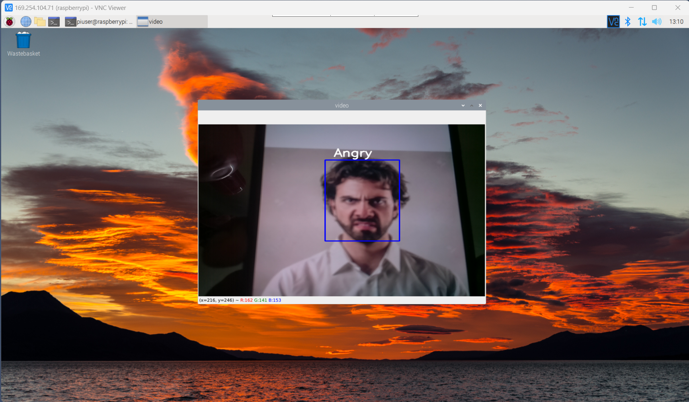

# Real-Time-Facial-Emotion-Detection


I have created a real-time facial emotion detection application using Python on Raspberry Pi. Utilised libraries like openCV for image processing and TensorFlow for training and prediction of seven facial
emotions using deep convolutional neural network (CNN).


## Model

Model is trained on the FER-2013 dataset which was published on International Conference on Machine Learning (ICML). The data consists of 48x48 pixel grayscale images of faces. The task is to categorize each face based on the emotion shown in the facial expression into one of seven categories (0=Angry, 1=Disgust, 2=Fear, 3=Happy, 4=Sad, 5=Surprise, 6=Neutral). The training set consists of 28,709 examples and the public test set consists of 3,589 examples.

Download datatset from: https://www.kaggle.com/datasets/msambare/fer2013


## Dependencies
 
- Raspberry Pi 4B board
- Pi camera 5MP
- Raspberry Pi OS with desktop 64-bit, kernel v5.15, debian v11 (bullseye)
- PuTTY : SSH and telnet client
- VNC Viewer
- Python 3
- Libraries: numpy, openCV, TensorFlow


## Steps to boot Raspberry Pi

1. Open Putty and enter the same IP address as entered while creating Pi Image on the SD card.
2. Enter Username and password same as entered while creating Pi Image in SD card.
3. Upon successful connection, Open VNC Viewer → connect to Raspberry PI to view the display of Raspberry CPU.
## Working

1. Create a Sequential model from FER-2013 dataset
2. Use Haar Cascade classifier to detect faces
3. Iterate over each detected face and draw a blue rectangle
4. For each detected face, it extracts the region of interest
5. Feed into the model for prediction
6. Display the predicted emotion

##  Demo Images



## Using a virtual environment

Install virtual environment:
```bash
sudo pip3 install virtualenv  
```

Open directory:
```bash
cd Emotion-detection 
```

Initialize the virtual environment:
```bash
virtualenv venv -p python3  
```

Activate the virtual environment:
```bash
source venv/bin/activate 
```

Install python dependencies in the virtual environment:
```bash
pip install -r requirements.txt
```


### Running the program

```bash
cd Emotion-detection  
source venv/bin/activate 
python run.py  
```


## References

- https://www.kaggle.com/datasets/msambare/fer2013
- https://projects.raspberrypi.org/en/projects/raspberry-pi-setting-up
- https://circuitdigest.com/microcontroller-projects/raspberry-pi-based-emotion-recognition-using-opencv-tensorflow-and-keras
- https://fablab.ruc.dk/facial-expression-recognition-on-a-raspberry-pi/
